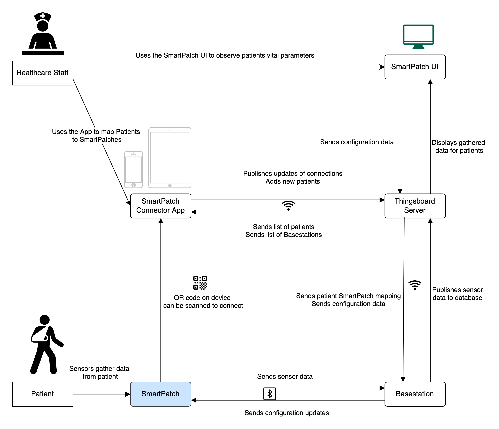
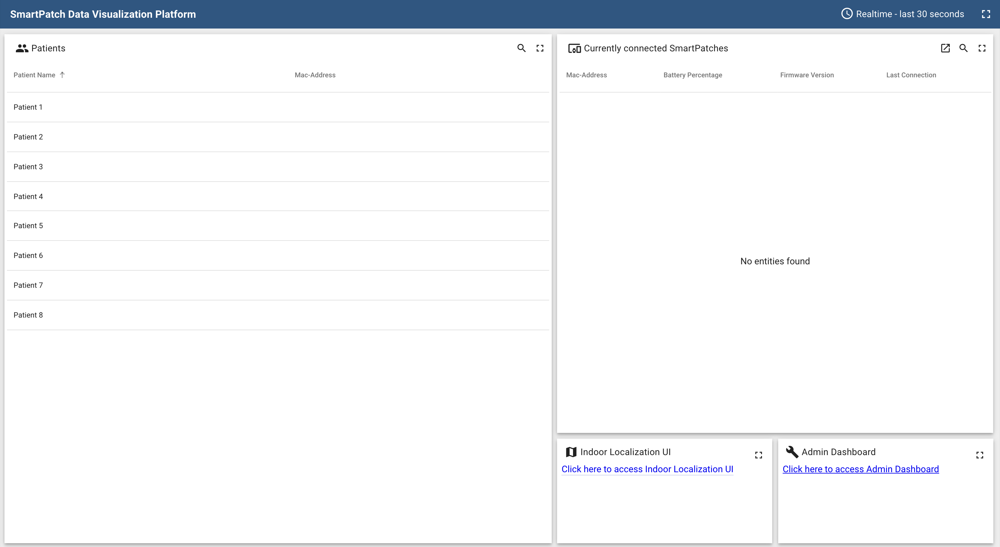
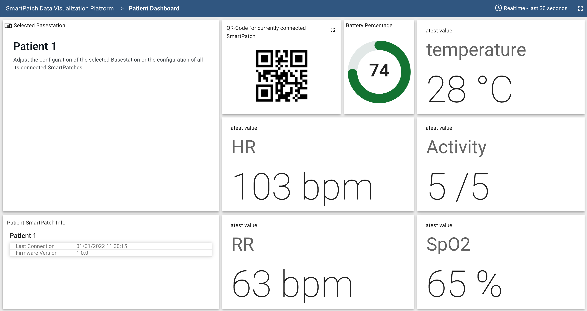
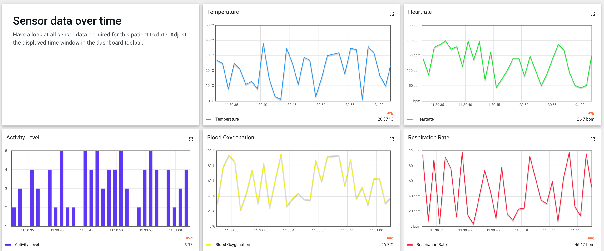
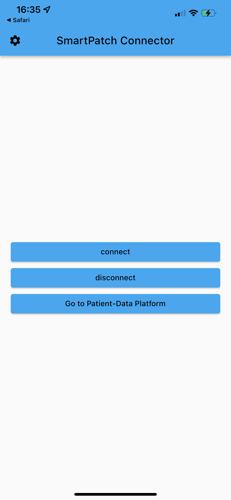
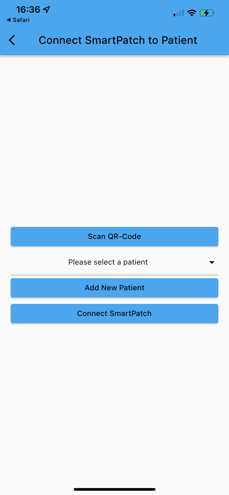

# SmartPatch System

## What is the SmartPatch System?
The SmartPatch System includes a SmartPatch medical wearable device for acquiring vital sensor data
and a supporting ecosystem consisting of a 
[Basestation Software](https://gitlab.ethz.ch/pbl/hs2021/flagship-smart-patch-2021/base-station-v1) 
designed to acquire the Sensor Data on a Basestation device (Raspberry Pi) and publishing it to a Thingsboard Server.
Further, it includes a [Thingsboard](https://thingsboard.io/) server setup to display the acquired data and the 
[SmartPatch Connector App](https://gitlab.ethz.ch/pbl/hs2021/flagship-smart-patch-2021/connector-app-v1) 
available for iOS and Android, making it easy to connect SmartPatches and assign them to a patient.
For more information on the SmartPatch System, please refer to my [bachelor thesis](assets/SmartPatch_System.pdf)
or to the [final presentation](assets/SmartPatch_Final_Presentation.pdf) of our project group.

## Contents of this repository

This repository links the following parts of the SmartPatch System:
- SmartPatch Base Station Software
- SmartPatch Connector App

Both parts were mainly developed by me, and all parts developed by team members are marked as such in the respective files.

## SmartPatch Base Station Software

The SmartPatch Base Station Software is a Python application that runs on a Raspberry Pi 4B.
It is designed to acquire sensor data from SmartPatch devices via Bluetooth Low Energy (BLE) and publish it to a Thingsboard server.
This data can then be viewed in the Thingsboard UI showcased in the figures below:

## SmartPatch Connector App

The SmartPatch Connector App is a mobile application that makes it easy to connect SmartPatches and assign them to a patient.
It is designed to be used by medical staff to connect SmartPatches to a Thingsboard server and assign them to a patient.
The application was developed using the Flutter framework and was tested for iOS and Android.

### Example Screenshots

